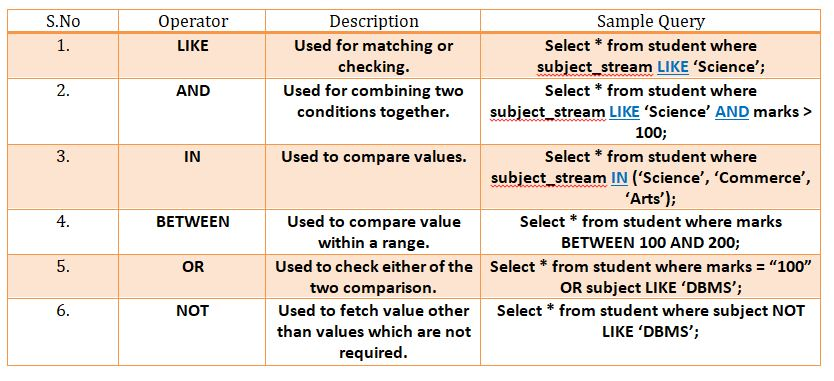

# Structured Query Language (SQL)
SQL is a query language developed to manage databases (schemas). We're going to use MySQL, the most popular SQL relational database management system for this lecture.

### MySQL Installation
MySQL is already installed in most Debian distributions, but if you need to install it for another OS then install the latest MySQL Community Server from https://dev.mysql.com/downloads/mysql/

We must make sure to install the MySQL drivers for Python since we'll be programming the lecture using Python 3. To install the MySQL driver for Python, type:

```conda install mysql-connector-python``` for Anaconda or ```pip install mysql-connector-python``` for pip.

### Tables & Data Types
In a database, there are multiple tables that make-up the database. Each table is a unique 2D matrix that organize the data of a category.

Each column in the table is assigned a data type. Common data types include:
- Numeric: INT, TINYINT, BIGINT, FLOAT
- String: VARCHAR, TEXT, CHAR
- Dates: DATE, DATETIME, TIMESTAMP
- Others: BINARY, JSON

### Relational Databases
Why are SQL databases called "relational"? This is because the tables in the database relate to each other.

For example, let's say there are two tables of ```users``` and ```countries```.

The ```users``` table has 3 columns:
- id is the id of the user
- country_id is the id of the country that the user is from
- full_name is the name of the user

The ```countries``` table has 2 columns:
- id is the id of the country
- country_name is the name of the country

Let's say there is a row in the ```users``` table of: id = 1, country_id = 5, full_name = "Pravat Bhusal"  
And there's a row in the ```countries``` table of: id = 5, country_name = "United States of America"

Notice how the country_id = 5 for the user, so we related the user with id 1 to the country "United States of America". This is the concept of relational databases!

### SQL Logical Operators
The operators below are the logical operators that are used in SQL. The other standard operators such as arithmetic, bit-wise, and comparision (boolean) are also implemented in SQL but are common in all programming languages so we're not going to post them in this lecture.

</img>
- https://www.minigranth.com/sql-tutorial/sql-operators/